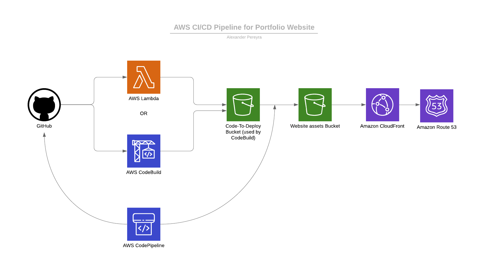
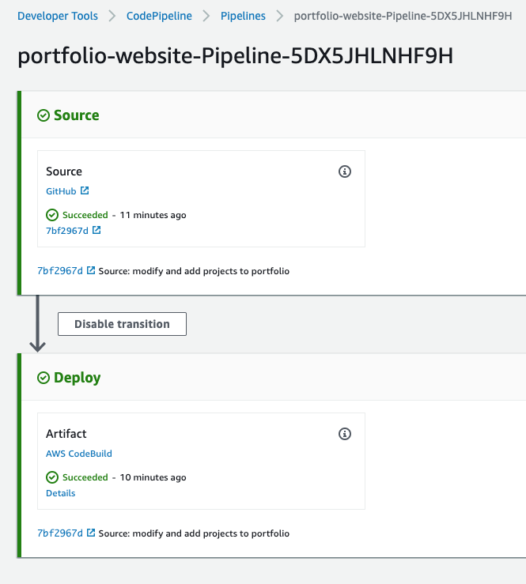

# portfolio-website

Code for portfolio website. want to use the same layout and change it up? see steps below and I'll show you how to replicate it! The deployment done via lamdba is done on separate repo. If you would like to experiment with that...I will link it below.



# aws cli cloudformation pipeline deployment

- First deploy the cloudformation template 'pipeline.json' or 'pipeline.yml' to your aws account either using the command below.
  *** remember to use the private github token for your repository and 'sitebucketname' value to your own as well.

```
aws cloudformation create-stack --capabilities CAPABILITY_IAM --parameters ParameterKey=BuildComputeType,ParameterValue=BUILD_GENERAL1_SMALL,ParameterKey=BuildImage,ParameterValue=aws/codebuild/ubuntu-base=14.04,ParameterKey=BuildType,ParameterValue=LINUX_CONTAINER,ParameterKey=GitHubBranch,ParameterValue=master,ParameterKey=GitHubRepo,ParameterValue=portfolio-website,ParameterKey=GitHubToken,ParameterValue=,ParameterKey=GitHubUser,ParameterValue=alexpereyra,ParameterKey=SiteBucketName,ParameterValue=alexander.pereyra.info --stack-name portfolio-website --template-body file://pipeline.json --region us-east-1
```

## setup contents

- The cloudformation template should have created a website bucket with the 'SiteBucketName' you named. Now clone this repo and copy over the directory structure.

- commit to your repo and watch the pipeline get kicked off in the aws pipeline console!



- Now experiment with the html code and structure! Have Fun!

Need to add to resume
```
Design using DevSecOps strategies to meet HIPAA security and compliance standards that conform with fedramp, soc, ect. audits. This includes identifying, planning, and architecting solutions using appropriate AWS services to securely process, store, and transmit data based in business needs.
```
